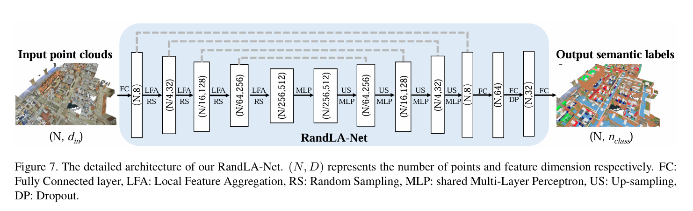
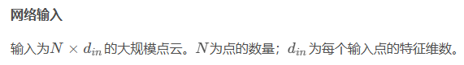
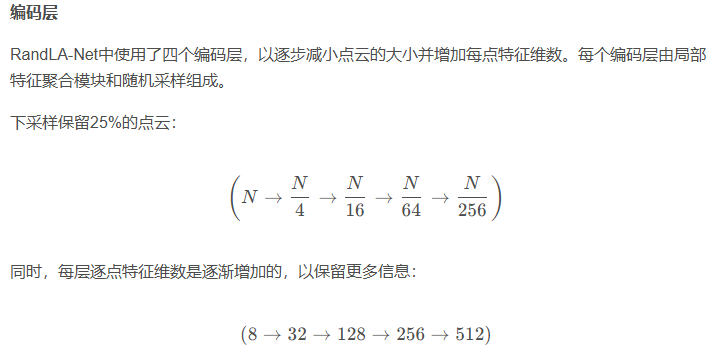
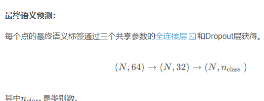
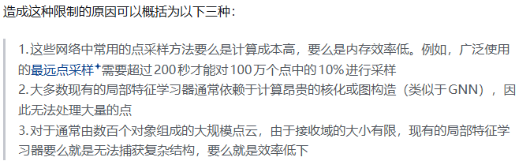
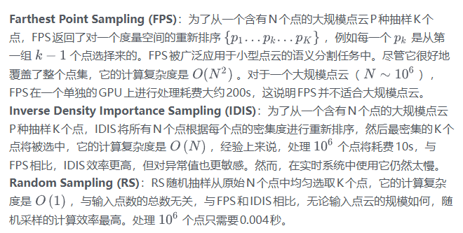
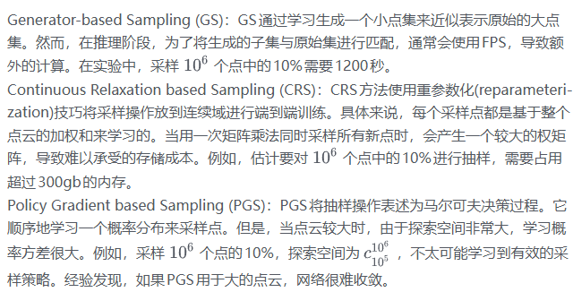
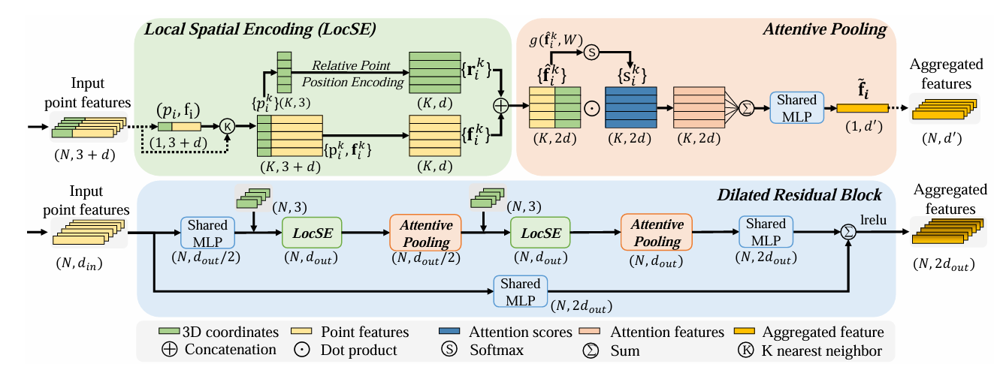
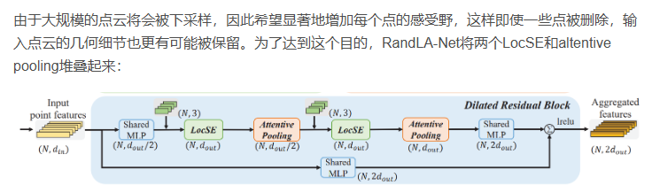
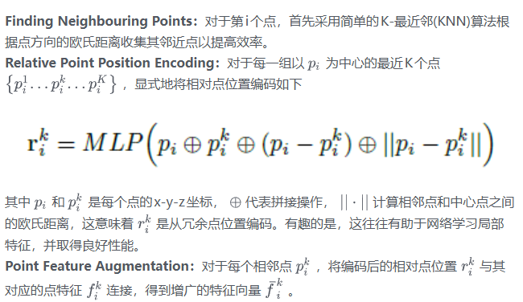

# 总体：
首先使用共享参数的MLP层提取输入点云每个点的特征。然后使用四个编码和解码层来学习每个点的特征。最后，使用三个全连接层和一个Dropout层来预测每个点的语义标签

输入：

编码层：

解码层：
在上述编码层之后使用四个解码层。对于解码器中的每一层，我们首先使用KNN算法为每个查询点（编码阶段对应的四倍于解码层输入点的点集）找到输入点中的一个最近邻点，然后通过最近邻插值对点特征集进行上采样（使查询点的特征等于距离它最近的输入点的特征）。接下来，通过跳跃连接将上采样特征与编码层生成的中间特征拼接起来，然后将共享参数的MLP应用于拼接的特征。

# 动机

## 前人研究的问题：

PointNet提出了处理点云的方法，但是大部分用于小点云，比如4k点于1*1m,并且不能直接扩展到没有块分区等预处理步骤的大规模点云数据中

## RandLA的改进：

随机抽样具有显著的计算和内存效率，但可能会偶然丢弃关键特征。为了克服这个问题，作者引入了一种新的局部特征聚合模块，逐步增加每个3D点的接受域，从而有效地保留几何细节。

## 难点：

目标：直接处理大规模的三维点云，而不需要任何预处理/后处理步骤，如体素化（voxelization）、块划分或图构造

1.建立一种内存和计算效率高的采样方法，逐步向下采样大规模点云，以适应当前GPU的限制
2.建立一个有效的局部特征学习器，逐步增加接受域的大小，以保持复杂的几何结构

# Methods：

##　采样：
首先点云数据太大了，肯定是要进行下采样的。传统的采样方法如下：

A．启发式

B．学习式

随机采样最适合处理大规模的点云，但是随机采样会导致许多的点特征被丢弃，所以设计局部特征聚合（Local Feature Aggregation）模块

## 局部特征融合：

局部特征聚合(LFA)模块是一个残差模块，由三个神经单元组成

### 1local spatial encoding (LocSE)
局部几何图案

输出中心点pi的局部几何结构

算法：

### 2attentive pooling

聚合邻近点特征的集合

注意机制来自动学习重要的局部特征

总的来说，给定输入点云P，对于第i个点Pi，LocSE和Attentive Pooling单元学习聚合其K个最近点的几何模式和特征，并最终生成一个信息特征向量fi
### 3dilated residual block

由于大的点云将被大幅向下采样，因此需要显著增加每个点的接受域，这样输入点云的几何细节更有可能被保留，即使一些点被删除
(参考ResNet的堆叠)
理论上讲，堆叠的units越多，这个block就越强大，因为它的范围会变得越来越大。然而，更多的units不可避免地会牺牲整体的计算效率，并且整个网络可能过拟合。在RandLA-Net中，作者简单地将两组LocSE和Attentive Pooling堆叠起来作为标准residual block

### 综上：
叠加多个局部特征聚合模块和随机采样层来实现RandLA-Net
优化器：Adam，lr=0.01，每个epoch后降低5%，最接近的点数k=16，从每个点云当中抽取固定的约10^5的点输入
测试过程中，整个原始点云被输入到我们的网络中，以推断每个点的语义，而不需要进行几何或块划分等预处理/后处理
平台：RTX2080Ti

# 实验：

关注在Semantic3D上，
Semantic3D有15和15个点云用于训练和测试。每张图约有1亿点，分布在160*240*30m的范围内，8个类
在这里，用3D坐标和颜色信息训练测试